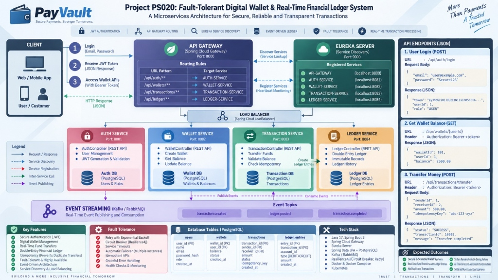

# PayVault — Project PS020: Fault-Tolerant Digital Wallet & Real-Time Financial Ledger System

> **A Microservices Architecture for Secure, Reliable, and Transparent Transactions**  
> *"More Than Payments, A Trusted Tomorrow"*

[](https://openjdk.org/)
[](https://spring.io/projects/spring-boot)
[](https://spring.io/projects/spring-cloud)
[](https://www.postgresql.org/)
[](https://jwt.io/)

---

## Architecture Overview



PayVault is an enterprise-grade, distributed microservices platform engineered for high-concurrency payment processing, wallet balance management, and immutable double-entry financial bookkeeping.

---

## Key System Features

- **Centralized API Gateway**: Dynamic routing, URL pattern matching, and single-entry reverse proxy.
- **Service Discovery & Registry**: Netflix Eureka server for resilient service lookup, load balancing, and heartbeat health checks.
- **Secure Authentication (JWT)**: Stateless authentication with BCrypt password hashing and role-based JWT claim verification.
- **Digital Wallet Management**: Real-time balance queries, wallet provisioning, fund credit, and debit handling.
- **Idempotent Transaction Processing**: Ensures non-duplicate transfers with unique idempotency keys and state tracking.
- **Double-Entry Financial Ledger**: Immutable accounting ledger entries (Debit/Credit pairs) tracking every movement of funds.
- **Event Streaming**: Asynchronous event publishing and consumption via Kafka / RabbitMQ (`transaction.created`, `ledger.posted`, `transaction.completed`).
- **Resilience & Fault Tolerance**:
  - Circuit Breakers & Retries with exponential backoff (Resilience4j)
  - Automatic service failover across multiple instances
  - Service timeouts and graceful error handling

---

## Service Registry & Port Mappings

| Service | Component Role | Direct Port | Gateway Route Path |
| :--- | :--- | :--- | :--- |
| **PayVault Server** | Netflix Eureka Discovery Server | `9000` | — (Internal Discovery Registry) |
| **GatewayService** | Spring Cloud API Gateway | `8000` | Entry Point (`http://localhost:8000/api/**`) |
| **AuthService1** | Authentication & JWT Service | `8080` | `/api/auth/**` |
| **WalletService** | Digital Wallet Management | `8082` | `/api/wallet/**` |
| **TransactionService** | Fund Transfers & Idempotency | `8083` | `/api/transactions/**` |
| **LedgerService** | Double-Entry Immutable Ledger | `8084` | `/api/ledger/**` |

---

## PostgreSQL Database Configuration & Schema

PayVault utilizes a dedicated PostgreSQL relational database instance across all core transactional microservices.

### Database Connection Details

- **Database Name**: `payvault`
- **Host**: `localhost`
- **Port**: `5433` *(as configured in `application.properties`)*
- **Username**: `postgres`
- **Password**: `root`
- **Default Schema**: `public`
- **JPA / Hibernate Settings**:
  - `spring.jpa.hibernate.ddl-auto=update` *(automatically validates and syncs schema)*
  - `spring.jpa.show-sql=true`
  - `spring.jpa.properties.hibernate.format_sql=true`

### Relational Schema & Tables

#### 1. `users` Table (AuthService1)
Stores registered users with BCrypt-hashed credentials and assigned roles.
```sql
CREATE TABLE public.users (
    id BIGSERIAL PRIMARY KEY,
    name VARCHAR(255) NOT NULL,
    email VARCHAR(255) UNIQUE NOT NULL,
    password VARCHAR(255) NOT NULL,
    role VARCHAR(50) NOT NULL
);
```

#### 2. `wallets` Table (WalletService)
Tracks individual user wallet balances and linking to account identities.
```sql
CREATE TABLE public.wallets (
    id BIGSERIAL PRIMARY KEY,
    user_id BIGINT NOT NULL,
    balance DOUBLE PRECISION NOT NULL DEFAULT 0.0
);
```

#### 3. `transactions` Table (TransactionService)
Logs every fund transfer attempt between senders and receivers.
```sql
CREATE TABLE public.transactions (
    id BIGSERIAL PRIMARY KEY,
    sender_id BIGINT NOT NULL,
    receiver_id BIGINT NOT NULL,
    amount DOUBLE PRECISION NOT NULL,
    status VARCHAR(50) NOT NULL,
    created_at TIMESTAMP DEFAULT CURRENT_TIMESTAMP
);
```

#### 4. `ledger_entries` Table (LedgerService)
Maintains the immutable double-entry journal records.
```sql
CREATE TABLE public.ledger_entries (
    entry_id BIGSERIAL PRIMARY KEY,
    transaction_id BIGINT NOT NULL,
    account_id BIGINT NOT NULL,
    type VARCHAR(10) NOT NULL, -- 'DEBIT' or 'CREDIT'
    amount DOUBLE PRECISION NOT NULL,
    created_at TIMESTAMP DEFAULT CURRENT_TIMESTAMP
);
```

### Database Inspection Queries (For Demo / Review)
```sql
-- View all registered users (ordered by ID)
SELECT * FROM public.users ORDER BY id ASC;

-- View all wallets and balances
SELECT * FROM public.wallets ORDER BY id ASC;

-- View transaction history
SELECT * FROM public.transactions ORDER BY id ASC;
```

---

## Review 1 — Faculty Demo Checklist

This section provides the exact step-by-step verification checklist for **Review 1**, demonstrating Eureka discovery, JWT authentication, Gateway routing, Wallet actions, Transaction creation, and PostgreSQL persistence.

> An executable REST Client file is provided in [`docs/auth-review1.http`](docs/auth-review1.http) for instant execution in VS Code REST Client or IntelliJ HTTP Client.

---

### 1. Eureka / Service Discovery

1. Open your browser and navigate to the Eureka Dashboard:
   ```
   http://localhost:9000
   ```
2. Under **Instances currently registered with Eureka**, show the faculty that all 4 core services are registered and healthy:
   - `AUTHSERVICE1` → `localhost:8080`
   - `GATEWAYSERVICE` → `localhost:8000`
   - `TRANSACTIONSERVICE` → `localhost:8083`
   - `WALLETSERVICE` → `localhost:8082`

---

### 2. JWT Authentication

#### A. User Registration

Register accounts for demonstration:

##### Request 1: Review User
- **Endpoint**: `POST http://localhost:8000/api/auth/register`
- **Headers**: `Content-Type: application/json`
```json
{
    "name": "ReviewUser",
    "email": "reviewuser@gmail.com",
    "password": "123456"
}
```

##### Request 2: Ashish (Sender / User 1)
- **Endpoint**: `POST http://localhost:8000/api/auth/register`
- **Headers**: `Content-Type: application/json`
```json
{
    "name": "Ashish",
    "email": "ashish@gmail.com",
    "password": "123456"
}
```

##### Request 3: Piyush (Receiver / User 2)
- **Endpoint**: `POST http://localhost:8000/api/auth/register`
- **Headers**: `Content-Type: application/json`
```json
{
    "name": "Piyush",
    "email": "piyush@gmail.com",
    "password": "123456"
}
```

#### B. User Login

Authenticate user credentials to receive a signed JWT token.

- **Method**: `POST`
- **Endpoint**: `http://localhost:8000/api/auth/login`
- **Headers**: `Content-Type: application/json`

##### Request Body:
```json
{
    "email": "ashish@gmail.com",
    "password": "123456"
}
```

##### Expected Response (`200 OK`):
```json
{
    "message": "Login successful",
    "tokenType": "Bearer",
    "token": "eyJhbGciOiJIUzI1NiJ9.eyJzdWIiOiJhc2hpc2hAZ21haWwuY29tIiwicm9sZSI6IlVTRVIiLCJpYXQiOjE3NDI1ODcyMDAsImV4cCI6MTc0MjU5MDgwMH0.xxxx..."
}
```

> **Demo Tip for Faculty**: Copy the returned `token` string and show that it is a valid HS256-signed JWT token containing user identity and claims.

---

### 3. Wallet Service THROUGH Gateway

All wallet requests route through the API Gateway (`:8000`), which dynamically forwards to `WalletService` (`:8082`).

#### A. Get Wallet
- **Method**: `GET`
- **Endpoint**: `http://localhost:8000/api/wallet/1`
- **Headers**: `Authorization: Bearer <JWT_TOKEN>`

##### Expected Response:
```json
{
    "userId": 1,
    "balance": 4000,
    "id": 1
}
```

#### B. Add Money
- **Method**: `POST`
- **Endpoint**: `http://localhost:8000/api/wallet/add/1?amount=1000`
- **Headers**: `Authorization: Bearer <JWT_TOKEN>`

##### Expected Response:
```json
{
    "userId": 1,
    "balance": 5000,
    "id": 1
}
```

#### C. Check Balance
- **Method**: `GET`
- **Endpoint**: `http://localhost:8000/api/wallet/1`
- **Headers**: `Authorization: Bearer <JWT_TOKEN>`

##### Expected Response:
```json
{
    "userId": 1,
    "balance": 5000,
    "id": 1
}
```

---

### 4. Transaction Service THROUGH Gateway

Execute fund transfers through the API Gateway (`:8000`), routing to `TransactionService` (`:8083`).

#### A. Create Transaction (Transfer from Ashish [User 1] to Piyush [User 2])
- **Method**: `POST`
- **Endpoint**: `http://localhost:8000/api/transactions`
- **Headers**:
  ```http
  Authorization: Bearer <JWT_TOKEN>
  Content-Type: application/json
  ```

##### Request Body:
```json
{
    "senderId": 1,
    "receiverId": 2,
    "amount": 1000,
    "status": "SUCCESS"
}
```

##### Expected Response (`200 OK`):
```json
{
    "senderId": 1,
    "receiverId": 2,
    "amount": 1000,
    "status": "SUCCESS",
    "createdAt": "2026-09-21T01:15:00",
    "id": 4
}
```

#### B. Get All Transactions
- **Method**: `GET`
- **Endpoint**: `http://localhost:8000/api/transactions`
- **Headers**: `Authorization: Bearer <JWT_TOKEN>`

---

### 5. Direct Service vs Gateway (Architectural Proof)

Show faculty the difference between calling microservices directly on their individual internal ports versus calling them through the centralized Spring Cloud Gateway:

| Microservice | Direct Call (Internal Port) | Call Through Gateway (Port 8000) |
| :--- | :--- | :--- |
| **AuthService1** | `http://localhost:8080/api/auth/login` | `http://localhost:8000/api/auth/login` |
| **WalletService** | `http://localhost:8082/api/wallet/1` | `http://localhost:8000/api/wallet/1` |
| **TransactionService** | `http://localhost:8083/api/transactions` | `http://localhost:8000/api/transactions` |

#### Key Benefits Demonstrated to Faculty:
1. **Single Entry Point**: Clients only need to know port `8000`.
2. **Decoupling**: Internal service ports (`8080`, `8082`, `8083`) can be firewalled from external access.
3. **Load Balancing**: The Gateway integrates with Spring Cloud LoadBalancer to distribute traffic across service instances.

---

### 6. PostgreSQL — Show Database

Demonstrate the persisted state directly in the PostgreSQL database:

```sql
-- Database: payvault (Port: 5433)

-- 1. Users Table (Ashish, Piyush, ReviewUser)
SELECT * FROM public.users ORDER BY id ASC;

-- 2. Wallets Table (Showing updated balance)
SELECT * FROM public.wallets ORDER BY id ASC;

-- 3. Transactions Table (Showing created transaction record)
SELECT * FROM public.transactions ORDER BY id ASC;
```

---

## System Requirements & Dependencies

### 1. Environment Prerequisites

| Requirement | Supported Version | Purpose |
| :--- | :--- | :--- |
| **Java JDK** | 25 (Compatible with 17+) | Core runtime for Spring Boot 4 / Java microservices |
| **Apache Maven** | 3.9+ | Build and dependency lifecycle manager |
| **PostgreSQL** | 16+ (Port: `5433`) | Relational persistence store for users, wallets, and transactions |
| **Docker & Docker Compose** | Latest (Optional) | Fast containerized startup for PostgreSQL |

### 2. Multi-Module Root Aggregator (`pom.xml`)

PayVault provides a top-level aggregator [`pom.xml`](pom.xml) enabling you to resolve, download, and build all dependencies across the entire microservices ecosystem with a single command:

```bash
# Resolve and download all dependencies for all microservices in one go:
mvn dependency:resolve

# Or build and package all microservices simultaneously:
mvn clean install -DskipTests
```

### 3. Microservice Dependency Manifest

The table below lists the dependencies defined and loaded in each microservice's `pom.xml`:

| Microservice | Core Dependencies Loaded | Purpose |
| :--- | :--- | :--- |
| **PayVault Server** | • `spring-cloud-starter-netflix-eureka-server`<br>• `spring-boot-starter-webmvc`<br>• `spring-boot-starter-actuator` | Service registry, health heartbeats, and cluster discovery |
| **GatewayService** | • `spring-cloud-starter-gateway-server-webmvc`<br>• `spring-cloud-starter-netflix-eureka-client`<br>• `spring-cloud-starter-loadbalancer`<br>• `spring-boot-starter-actuator` | Reverse proxy routing, client load balancing, and route predicates |
| **AuthService1** | • `spring-boot-starter-webmvc`<br>• `spring-boot-starter-security`<br>• `spring-boot-starter-data-jpa`<br>• `org.postgresql:postgresql`<br>• `io.jsonwebtoken:jjwt-api:0.12.6`<br>• `io.jsonwebtoken:jjwt-impl:0.12.6`<br>• `io.jsonwebtoken:jjwt-jackson:0.12.6`<br>• `spring-cloud-starter-netflix-eureka-client` | User registration, password encryption (BCrypt), JWT token signing and verification, JPA database mapping |
| **WalletService** | • `spring-boot-starter-webmvc`<br>• `spring-boot-starter-data-jpa`<br>• `org.postgresql:postgresql`<br>• `spring-cloud-starter-netflix-eureka-client`<br>• `spring-boot-starter-actuator` | Digital wallet accounts, balance queries and updates, transactional persistence |
| **TransactionService** | • `spring-boot-starter-webmvc`<br>• `spring-boot-starter-data-jpa`<br>• `org.postgresql:postgresql`<br>• `spring-cloud-starter-netflix-eureka-client`<br>• `spring-boot-starter-actuator` | Money transfers, idempotency key checks, audit transaction logs |

### 4. Infrastructure Dependencies (Docker Compose)

Launch the required PostgreSQL instance with the pre-configured `payvault` database and credentials (`postgres` / `root` on port `5433`) using the bundled [`docker-compose.yml`](docker-compose.yml):

```bash
docker compose up -d
```

---

## Local Development & Setup

### 1. Prerequisites
- **JDK 25** (or compatible JDK 17+)
- **PostgreSQL** running on port `5433` (or run `docker compose up -d`)
- **Maven 3.9+**

### 2. Startup Order
To ensure proper service discovery and routing, start the microservices in the following sequence:

1. **Start Database (if using Docker)**:
   ```bash
   docker compose up -d
   ```

2. **Service Registry (Eureka)**:
   ```bash
   cd PayVault
   ./mvnw spring-boot:run
   ```
   *Dashboard available at:* `http://localhost:9000`

3. **API Gateway**:
   ```bash
   cd GatewayService
   ./mvnw spring-boot:run
   ```
   *Gateway listening on:* `http://localhost:8000`

4. **Authentication Service**:
   ```bash
   cd AuthService1
   ./mvnw spring-boot:run
   ```
   *Service listening on:* `http://localhost:8080`

5. **Wallet & Transaction Services**:
   ```bash
   cd WalletService
   ./mvnw spring-boot:run
   ```
   ```bash
   cd TransactionService
   ./mvnw spring-boot:run
   ```

---

## Authors & Contributors

- **Sohan Kumar Sahu**
- **Ashish**
- **Piyush**

---

## License

Built for secure, transparent, and resilient digital financial transactions.
Distributed under the MIT License.
